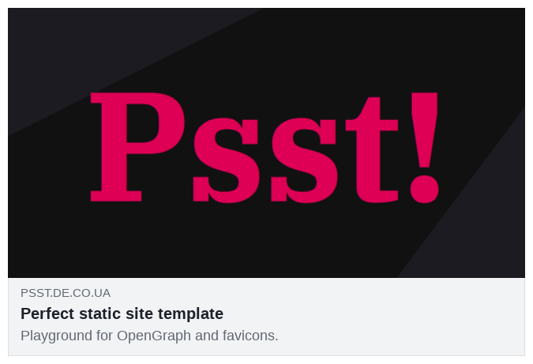

Hello, world!

This is a small template for a small static site.

(Almost) Proper Favicon
-----------------------

Indeed, this site was made to mess with 'favicons'. This is _damn hard thing_ in a modern web. You know, different formats, tons of scaled images, links with strange names, web manifests. There is so many ways to shoot youself in the foot.

### Single source of trurh: `favicon.svg`

All other formats is generated from the SVG source.

 - Here are a very basic image to start ;)
 - Sample media query for dark theme included
 - I prefer to add `width` and `height` to root `<svg>` tag (200×200 here)

### Legacy `favicon.ico` (32×32)

It is present in the site's root, but _not_ linked.

Why it is not linked?

 - If we will provide the link to it, then we'll have to fight some [stupid Chome bugs][1].
 - And, indeed, who really care about MSIE now?

Why it is still present?

 - Some stupid user agents will try to load path `/favicon.ico` anyway, even if there is no such link on page, so let's just decrease number of 404s in web server logs

_(Research in progress…)_

### Apple touch icon (180×180)

It also is present on predefined place `/apple-touch-icon.png`, but _not_ linked.

 - Plain white background added
 - Tested on Safari 9 on antique iPad 2

Why it is not linked?

 - Safari will [try to load it anyway][2] when needed
 - In Firefox, if all that links is present, the unholy goddamned `FaviconLoader.jsm` will mindlessly try to load your favicon and Apple touch icon _both_, even if it is not really needed

Manifest: no web manifest
-------------------------

Web manifest is [considered harmful][3] for non-PWA multi-page sites, so it's not included.

Instead of it, there is a bit outdated, but [standard][4] meta tag `application-name`.
It is supported by mobile Chrome.

Known imperfections:

 - Mobile Firefox ignores `application-name` meta tag (and even did not use icon)
 - Safari 9 ignores `application-name` meta tag

_(Research in progress…)_

OpenGraph
---------

There is set of OpenGraph tags. Nothing special, but it works. Unfortunately, SVG is not supported by OpenGraph, so [there is PNG version](opengraph.png) made of SVG.

How it works?

### Facebook

(That was done not in the real Facebook, only the [Sharing Debugger][5].)

### Twitter (DM)

<picture>
  <source media="(prefers-color-scheme: dark)" srcset="screenshots/twitter_dark.png">
  <source media="(prefers-color-scheme: light)" srcset="screenshots/twitter_light.png">
  
</picture>

### Skype chat

<picture>
  <source media="(prefers-color-scheme: dark)" srcset="screenshots/skype_dark.png">
  <source media="(prefers-color-scheme: light)" srcset="screenshots/skype_light.png">
  
</picture>

Well. It works.

Note: by using media queries, one can easily choose dark and light versions of screenshots, to conform overall page style. Even SVG icon can have media queries. But not OpenGraph.

Mandatory section
-----------------

Lorem ipsum dolor sit amet, consectetur adipiscing elit, sed do eiusmod tempor incididunt ut labore et dolore magna aliqua. Ut enim ad minim veniam, quis nostrud exercitation ullamco laboris nisi ut aliquip ex ea commodo consequat. Duis aute irure dolor in reprehenderit in voluptate velit esse cillum dolore eu fugiat nulla pariatur. Excepteur sint occaecat cupidatat non proident, sunt in culpa qui officia deserunt mollit anim id est laborum.

P.S.
----

[Valid HTML](https://validator.w3.org/nu/?doc=https%3A%2F%2Fpsst.de.co.ua%2F)

[Valid CSS](https://jigsaw.w3.org/css-validator/validator?uri=https%3A%2F%2Fpsst.de.co.ua%2Fstyle.css)

P.P.S.
------

Indeed, _indeed_, this site is also a placeholder for a [Makefile][6].

[1]: https://css-tricks.com/favicons-how-to-make-sure-browsers-only-download-the-svg-version/
[2]: http://test.de.co.ua/2021/11/08/favicon-research.html
[3]: https://twitter.com/kastaneda/status/1465484668799754245
[4]: https://html.spec.whatwg.org/multipage/semantics.html#standard-metadata-names
[5]: https://developers.facebook.com/tools/debug/
[6]: https://github.com/kastaneda/psst/blob/master/Makefile
